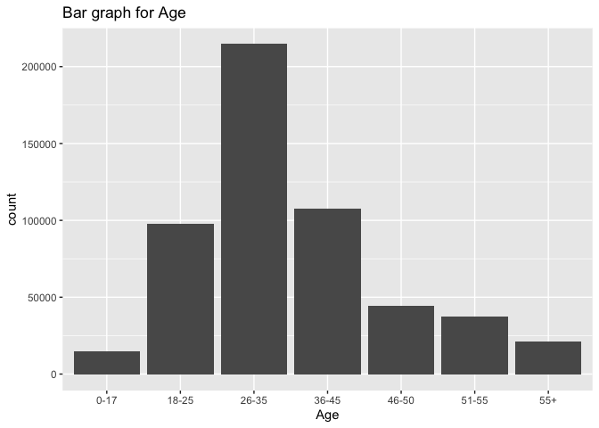
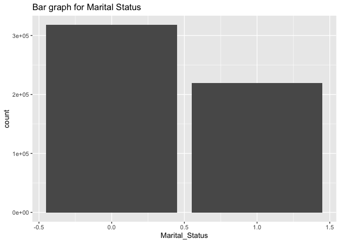
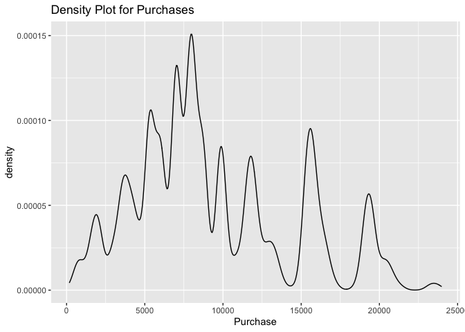
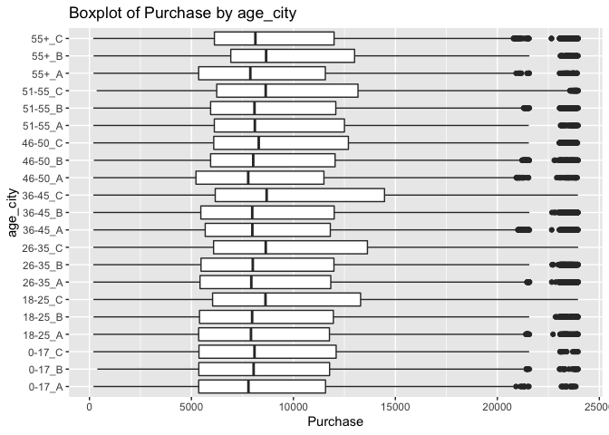
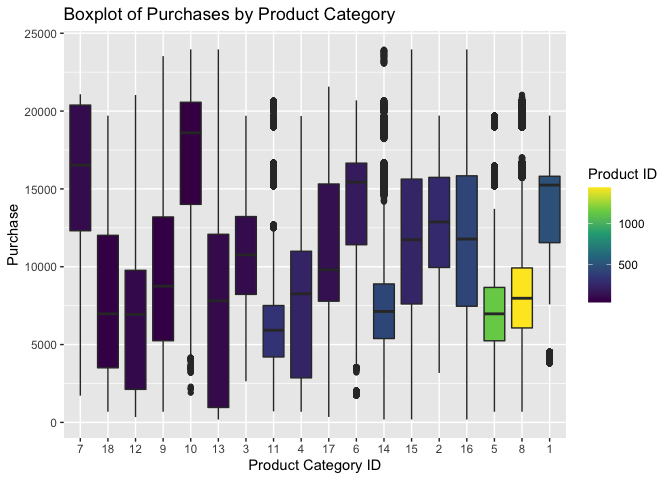

Black Friday Analysis
================
Shivangi

## Analysis of Black Friday Dataset

My work is to perform a preliminary analysis of consumer behavior using
sales data on **Black Friday**. I downloaded the
[BlackFriday](https://www.kaggle.com/llopesolivei/blackfriday#) dataset
from Kaggle, and loaded it into a new dataset called `blackfriday`.

``` r
suppressPackageStartupMessages(library(tidyverse))
blackfriday <- read_csv("BlackFriday.csv", show_col_types = FALSE)
problems(blackfriday)
```

    ## # A tibble: 0 × 5
    ## # … with 5 variables: row <int>, col <int>, expected <chr>, actual <chr>,
    ## #   file <chr>

``` r
blackfriday %>% 
  ggplot(aes(x = Age)) + 
  geom_bar() + 
  labs(title = "Bar graph for Age")
```

<!-- -->

``` r
blackfriday %>% 
  ggplot(aes(x = Marital_Status)) + 
  geom_bar() + 
  labs(title = "Bar graph for Marital Status")
```

<!-- -->

``` r
blackfriday %>% 
  ggplot(aes(x = Purchase)) + 
  geom_density() + 
  labs(title = "Density Plot for Purchases")
```

<!-- -->

As age and marital status are categorical variables, I am showing them
in a bar graph. For purchases I am using a density graph. From the above
three graphs, I can deduce that the data for Age, Marital Status and
Purchases doesn’t have any unusual values.

Here is a description of the variables. “Masked” means that the values
have been changed to be numeric values rather than the original
categories.

| Variable                   | Definition                                          |
|----------------------------|-----------------------------------------------------|
| User_ID                    | User ID                                             |
| Product_ID                 | Product ID                                          |
| Gender                     | Sex of User                                         |
| Age                        | Age in bins                                         |
| Occupation                 | Occupation (Masked)                                 |
| City_Category              | Category of the City (A,B,C)                        |
| Stay_In_Current_City_Years | Number of years stay in current city                |
| Marital_Status             | Marital Status                                      |
| Product_Category_1         | Product Category (Masked)                           |
| Product_Category_2         | Product may belongs to other category also (Masked) |
| Product_Category_3         | Product may belongs to other category also (Masked) |
| Purchase                   | Number of Purchases                                 |

``` r
blackfriday <- unite(blackfriday, age_city, Age, City_Category)
blackfriday %>% 
  ggplot(aes(x = age_city, y = Purchase)) + 
  geom_boxplot() + 
  coord_flip()+
  labs(title = "Boxplot of Purchase by age_city")
```

<!-- -->

Few age groups like 18-25, 26-35, 36-45 are making more purchases than
others in especially city code C. For age group 55+, it is noticable
that people in city code B are making more purchases than others in that
age group.

``` r
blackfriday %>% filter(is.na(Product_Category_1))
```

    ## # A tibble: 0 × 11
    ## # … with 11 variables: User_ID <dbl>, Product_ID <chr>, Gender <chr>,
    ## #   age_city <chr>, Occupation <dbl>, Stay_In_Current_City_Years <chr>,
    ## #   Marital_Status <dbl>, Product_Category_1 <dbl>, Product_Category_2 <dbl>,
    ## #   Product_Category_3 <dbl>, Purchase <dbl>

``` r
blackfriday %>% filter(is.na(Product_Category_2), !is.na(Product_Category_3))
```

    ## # A tibble: 0 × 11
    ## # … with 11 variables: User_ID <dbl>, Product_ID <chr>, Gender <chr>,
    ## #   age_city <chr>, Occupation <dbl>, Stay_In_Current_City_Years <chr>,
    ## #   Marital_Status <dbl>, Product_Category_1 <dbl>, Product_Category_2 <dbl>,
    ## #   Product_Category_3 <dbl>, Purchase <dbl>

``` r
blackfriday_cat <- blackfriday %>% pivot_longer(c('Product_Category_1', 'Product_Category_2', 'Product_Category_3'), names_to = "Category_Order", values_to = "Prod_Category_ID", values_drop_na = TRUE)
blackfriday_cat
```

    ## # A tibble: 1,072,446 × 10
    ##    User_ID Product_ID Gender age_city Occupation Stay_…¹ Marit…² Purch…³ Categ…⁴
    ##      <dbl> <chr>      <chr>  <chr>         <dbl> <chr>     <dbl>   <dbl> <chr>  
    ##  1 1000001 P00069042  F      0-17_A           10 2             0    8370 Produc…
    ##  2 1000001 P00248942  F      0-17_A           10 2             0   15200 Produc…
    ##  3 1000001 P00248942  F      0-17_A           10 2             0   15200 Produc…
    ##  4 1000001 P00248942  F      0-17_A           10 2             0   15200 Produc…
    ##  5 1000001 P00087842  F      0-17_A           10 2             0    1422 Produc…
    ##  6 1000001 P00085442  F      0-17_A           10 2             0    1057 Produc…
    ##  7 1000001 P00085442  F      0-17_A           10 2             0    1057 Produc…
    ##  8 1000002 P00285442  M      55+_C            16 4+            0    7969 Produc…
    ##  9 1000003 P00193542  M      26-35_A          15 3             0   15227 Produc…
    ## 10 1000003 P00193542  M      26-35_A          15 3             0   15227 Produc…
    ## # … with 1,072,436 more rows, 1 more variable: Prod_Category_ID <dbl>, and
    ## #   abbreviated variable names ¹​Stay_In_Current_City_Years, ²​Marital_Status,
    ## #   ³​Purchase, ⁴​Category_Order

``` r
blackfriday_cat %>% group_by(Prod_Category_ID) %>% mutate(distProdID = n_distinct(Product_ID)) %>% ungroup() %>% ggplot(aes(x = reorder(Prod_Category_ID, Purchase, sum), y = Purchase)) + geom_boxplot(aes(fill = distProdID)) + scale_fill_viridis_c() + labs(title = "Boxplot of Purchases by Product Category", x = "Product Category ID", fill = "Product ID")
```

<!-- -->

We can notice that products with higher product IDs have been purchased
lesser number of times than some of the products with lower number of
purchases. The previous command to make product category ID as one
single column instead of three columns helped visualise this data
better. It was also beneficial for creating this boxplot. As it would
have been a little difficult to visualize three different column in a
single graph.
